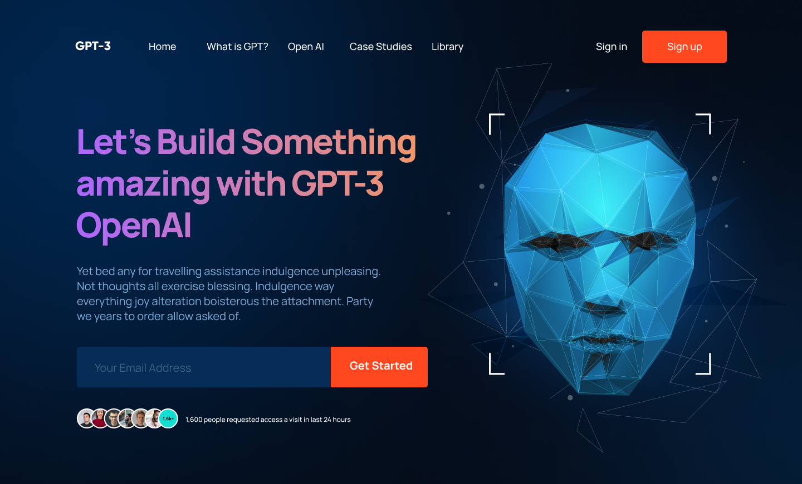

<h1 align="center">GPT-3 Landing Page</h1>

## :rocket: Demo
You can visit the site at: [view website](https://marcosic.netlify.app/home/)

## :sparkles: Introduction
This repository contains the source code for a landing page that focuses on presenting GPT-3 (fictional representation).

The landing page was created as part of a "JavaScript Mastery" project on YouTube, based on a design crafted in Figma. Animation has been added, and the text has been enhanced to align with the theme of the site.

### Design 
The figma design I took as a reference was [URL](https://www.figma.com/file/lz9lLpFHMxHm2odnwM3R0z/gpt3?type=design&node-id=0-1&mode=design&t=Y2RJKX9EnjgOxyI2-0):target="_blank" here you can visit it to see how the original reference

### Stack
The project is developed in Angular and uses these technologies:

   

## ℹ️ Development server
In order to deploy a local version of the project you must:
- Download the project from github
- Run `npm install` at the root of the project
- Run `ng s -o` for a dev server. Navigate to `http://localhost:4200/`.
The application will automatically reload if you change any of the source files.

## ℹ️ Build
Run `ng build` to build the project. The build artifacts will be stored in the `dist/` directory.

## 💪 Project status
The project, being a simple landing page based on a figma design, is already finished, I liked the result and it was fun to do it.
